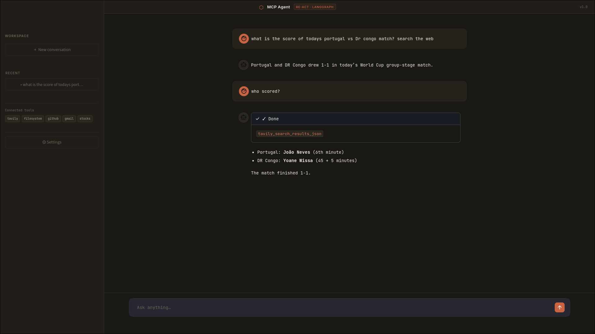
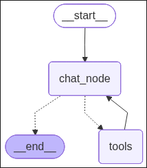

# MCP Agent

A conversational AI agent built with LangGraph and Streamlit, featuring a ReAct reasoning loop, persistent conversation history, and multi-tool integration via the Model Context Protocol (MCP).

---
### Click to watch Demo:

[](https://youtu.be/Gcx72LP7Qh8)

---

## Overview

MCP Agent is a full-stack chat application that connects a large language model to a suite of external tools — web search, file system access, GitHub, Gmail, and stock data — through a unified agent interface. The agent follows a ReAct (Reasoning + Acting) pattern, deciding at each step whether to respond directly or invoke a tool before continuing.

Conversations are persisted to a local SQLite database, allowing users to resume previous threads from the sidebar at any time.

---

## Features

- **ReAct agent loop** powered by LangGraph with conditional tool-calling edges
- **Multi-server MCP integration** for filesystem, GitHub, Gmail, and a remote expense server
- **Web search** via Tavily
- **Stock price lookup** via Alpha Vantage
- **Persistent conversation threads** backed by an async SQLite checkpointer
- **Environment configuration UI** set API keys directly from the app without touching files manually
- **Streaming responses** with live tool-status indicators
- **Compatible with any OpenAI-compatible LLM endpoint**

---

## Architecture

```
Streamlit UI
    |
    v
LangGraph StateGraph
    |-- chat_node  (LLM with bound tools)
    |-- tools node (ToolNode: Tavily, Stock, MCP tools)
    |
    v
AsyncSqliteSaver (checkpointer)
    |
    v
MultiServerMCPClient
    |-- filesystem  (stdio, @modelcontextprotocol/server-filesystem)
    |-- github      (stdio, @modelcontextprotocol/server-github)
    |-- gmail       (stdio, @sowonai/mcp-gmail)
    |-- expense     (streamable_http, remote FastMCP server)
```
[]
---

## Requirements

- Python 3.10 or higher
- Node.js 18 or higher (required for MCP stdio servers via `npx`)
- An OpenAI-compatible LLM API endpoint and key

---

## Installation

**1. Clone the repository**

```bash
git clone https://github.com/8ven0m8/Agentic-MCP-Chatbot.git
cd Agentic-MCP-Chatbot
```

**2. Install Python dependencies**

```bash
pip install -r requirements.txt
```

**3. Configure environment variables**

Edit the env file and fill in your credentials:

Or launch the app and use the built-in Settings dialog to configure everything from the UI.

**4. Run the app**

```bash
streamlit run frontend.py
```

---

## Environment Variables

| Variable | Description |
|---|---|
| `LLM_API_KEY` | API key for your LLM provider |
| `LLM_API_URL` | Base URL of the OpenAI-compatible endpoint |
| `TAVILY_API_KEY` | Tavily search API key |
| `STOCK_API` | Alpha Vantage API key |
| `GITHUB_PERSONAL_ACCESS_TOKEN` | GitHub personal access token |
| `CLIENT_ID` | Google OAuth client ID (for Gmail) |
| `CLIENT_SECRET` | Google OAuth client secret |
| `REFRESH_TOKEN` | Google OAuth refresh token |
| `FILESYSTEM_DIRS` | Comma-separated list of directories the filesystem tool may access |
| `LANGSMITH_API_KEY` | LangSmith API key (optional, for tracing) |
| `LANGCHAIN_TRACING_V2` | Set to `true` to enable LangSmith tracing |
| `LANGCHAIN_ENDPOINT` | LangSmith endpoint URL |
| `LANGCHAIN_PROJECT` | LangSmith project name |

---

## Tool Reference

| Tool | Source | Description |
|---|---|---|
| Tavily Search | LangChain community | Real-time web search, up to 10 results |
| Stock Price | Alpha Vantage | Latest quote for any ticker symbol |
| Filesystem | MCP stdio | Read and write files within allowed directories |
| GitHub | MCP stdio | Browse repositories, issues, pull requests, and more |
| Gmail | MCP stdio | Read and send email via OAuth |
| Expense | MCP HTTP | Remote expense tracking server |

---

## Project Structure

```
.
├── app.py          # Streamlit UI, sidebar, settings dialog, streaming logic
├── backend.py      # LangGraph graph definition, LLM setup, MCP client, checkpointer
├── style.css       # Custom CSS for the UI
├── chatbot.db      # SQLite database for conversation persistence (auto-created)
└── .env            # Environment variables
```

---
